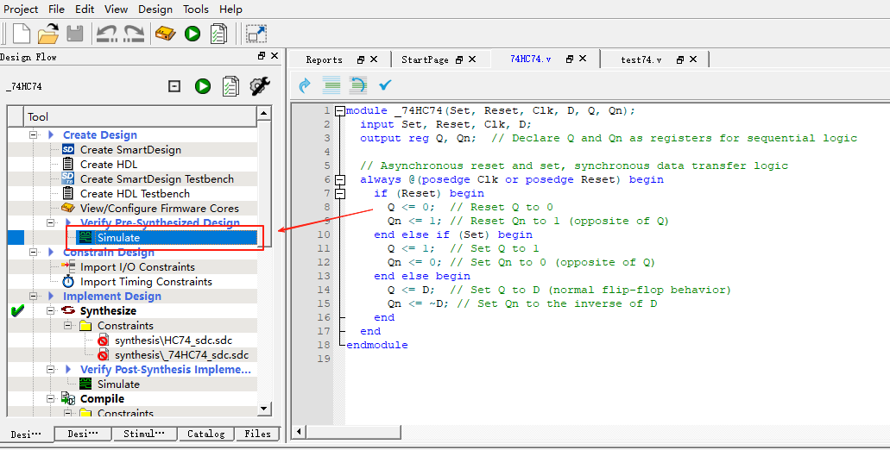
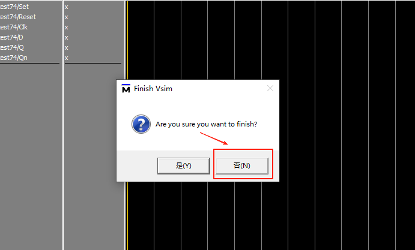
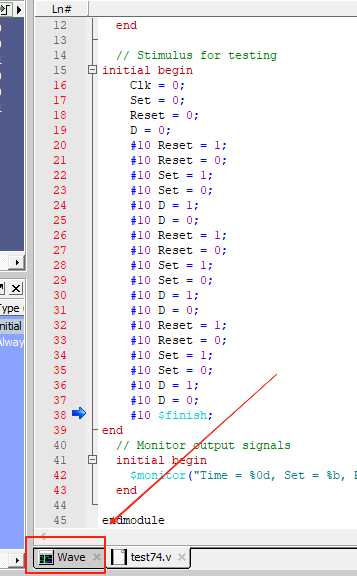
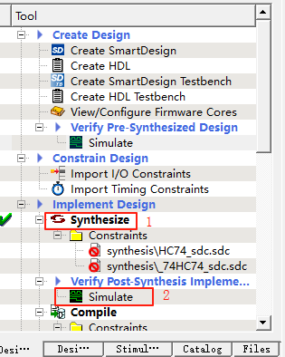

注意libero的项目路径不能存在中文，否则会报错或打不开。

### 仿真环境

- 仿真工具：Libero SoC v11.9
- 系统： Windows 10

### 使用方法：

1. 双击打开.prjx工程项目文件
2. 双击菜单栏中的“Simulate”

3. 若出现此框，选“否” 

4. 此时没有出现波形图，点击下方的wave窗口即可

5. 截图后关闭ModelSim的窗口（一定要关掉，否则下次不会出现波形窗口）
6. 双击Synthesis，等待左边打绿色勾后，双击下方的“Simulate”，注意和第二步的不一样

7. 若出现选项框，请重复步骤3-4

本教程写于2024/12/29，
github@Mamekokwai
若出现错误，可能是运行环境不对或者版本不匹配，请误联系作者，因为我这里是测试完全正常的。
